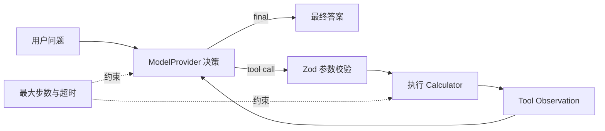
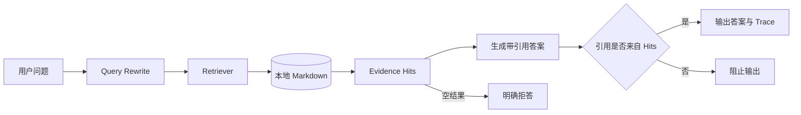
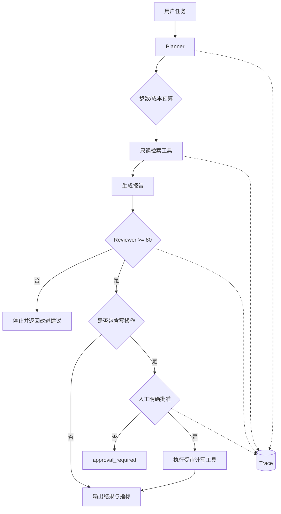
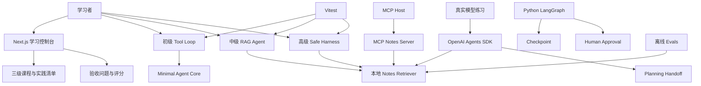

# AI Agent 工程学习路径

Agent 工程路线：从概念与最小 Agent Loop，逐步学习 RAG、Harness、Skills、MCP、多 Agent、Browser Agent、评估、安全与真实产品交付。

学习控制台分为初级、中级、高级，共 9 个阶段。每阶段提供精读资料、阅读目标、可勾选实践、验收问题和评分；进度保存在浏览器本地。核心代码保持小而可测试，真实模型调用通过 `OPENAI_API_KEY` 启用；单元测试和检索评估不需要 API Key。

## 从这里开始

```bash
npm install
npm run exercise:beginner -- "计算 12 乘以 7"
npm run exercise:intermediate -- "Agent loop 是什么？"
npm run exercise:advanced -- "研究 Agent 并发布报告"
```

上面三个练习都不需要 API Key。高级练习第一次会停在人工审批；确认 Trace 和待发布内容后，再执行：

```bash
npm run exercise:advanced -- "研究 Agent 并发布报告" --approve
```

然后执行 `npm run dev` 打开学习控制台，按初级 → 中级 → 高级完成 9 个阶段。需要体验真实模型时，再复制环境变量：`cp .env.example .env.local`。

原 [8 周执行手册](docs/8-week-guide.md) 保留为密集学习参考；页面中的三级路线是当前主线。

## 三级代码练习


### 初级：看懂最小 Agent Loop

入口：`src/exercises/beginner-agent.ts`

你会练习：

- 消息历史如何保存 user、assistant 与 tool observation；
- 模型如何通过结构化参数选择工具；
- Zod 为什么必须在工具执行前校验参数；
- 工具结果如何返回模型形成下一轮决策；
- 最大步数、超时和结构化错误如何阻止失控。




重点练习位置已经用 `TODO` 标出。先增加 `power` 工具操作，再尝试连续两次工具调用，最后才接真实模型 API。

验收：

```bash
npm run exercise:beginner -- "计算 24 除以 6"
npm test -- tests/minimal-agent.test.ts tests/exercises.test.ts
```

完成标准：能够不看代码解释 `observe → decide → act → observe`，并说明为什么工具错误也应该作为 observation 返回模型。

### 中级：构建有证据的 RAG Agent

入口：`src/exercises/intermediate-rag-agent.ts`

你会练习：

- Query Rewrite、Retrieve、Ground 与 Citation Validation；
- 无证据时明确拒答，而不是让模型补全；
- 检索接口与具体实现解耦；
- 只允许引用本次检索真实返回的 source；
- 如何用固定评估集比较关键词、向量和混合检索。




替换检索或模型时，应保持 `Retriever` 和 `GroundedAnswer` 接口不变，这样同一组测试和 Eval 可以持续运行。

验收：

```bash
npm run exercise:intermediate -- "MCP 如何连接工具？"
# 用同一批 50 条数据比较关键词与本地向量检索
npm run exercise:intermediate -- --benchmark

# 可选：配置 OPENAI_API_KEY 后，让真实模型只根据检索证据生成摘要
npm run exercise:intermediate -- "MCP 如何连接工具？" --real-model

npm test -- tests/notes.test.ts tests/exercises.test.ts
```

默认向量是无 API Key 的 Hash Embedding 教学基线，不代表生产语义模型。完成标准：每条关键结论都能定位到真实文件与行号；删除或伪造 source 后引用校验必须失败；检索升级必须报告通过率、平均/P95 延迟和成本。

当前 50 条基线中，关键词检索通过 50/50，本地 Hash Vector 通过 47/50。这个结果刻意保留：换成“向量”不保证更好，应分析失败用例后再决定是否引入真实 Embedding、混合检索或 Reranker。

### 高级：实现安全可观测的 Agent Harness

入口：`src/exercises/advanced-safe-agent.ts`

你会练习：

- 显式 Planner、Tool Executor、Reviewer 与停止条件；
- 读操作和写操作的风险分级；
- 高风险工具执行前的确定性人工审批；
- 步数预算、工具超时、质量门禁和运行指标；
- Trace、失败分类、回放与安全红队测试。




权限门禁必须写在模型外部：Prompt 可以提醒模型谨慎，但不能替代程序级授权。练习中的 `publish_report` / `delete_file` 都是模拟写操作，不会真实发布或删盘。

已完成能力：

- `delete_file` 高风险工具：未 `--approve-delete` 时 `execute` 计数必须为 0；
- 计划经 Zod `planSchema` 校验，非法步骤直接 `blocked`；
- 工具 `cost` + 步数/金额双预算；
- 规则 Reviewer + 可选 LLM Judge + 人工校准样本；
- `--persist` 写入 `data/traces/*.jsonl`（含 `failureCategory`）；
- Prompt injection 只记入 `security` 事件，不能改写 `approve*`。

验收：

```bash
# 应停在 approval_required，写工具调用次数为 0
npm run exercise:advanced -- "研究 Agent 并发布报告"

# 明确批准后才允许执行模拟发布
npm run exercise:advanced -- "研究 Agent 并发布报告" --approve

# 删除同理：未批准绝不进入 execute
npm run exercise:advanced -- "研究 Agent 并删除临时文件"
npm run exercise:advanced -- "研究 Agent 并删除临时文件" --approve-delete

# 持久化 Trace，便于失败分类与回放
npm run exercise:advanced -- "研究 Agent 并发布报告" --persist

npm test -- tests/exercises.test.ts
```

完成标准：未批准时高风险工具永远不会进入 `execute`；注入话术不能提升权限；每次运行都能看到步骤数、工具调用数、花费、耗时、Reviewer 分数和失败分类。

## 推荐练习顺序

1. 先运行示例并阅读 Trace，不要立刻改代码。
2. 画出当前数据流，说明每个安全边界在哪里。
3. 每次只完成一个 `TODO`，立即补测试。
4. 故意制造非法参数、空证据、超时、预算耗尽和未授权写操作。
5. 保存失败样例，再接真实模型；不要让随机模型输出掩盖控制流问题。
6. 最后运行 `npm test`、`npm run eval`、`npm run typecheck`，记录修改前后指标。


## 可运行模块

- `src/core/minimal-agent.ts`：无框架 Agent loop，含 schema 校验、工具超时、结构化错误和最大步数。
- `src/exercises/beginner-agent.ts`：本地可预测 Tool Loop，适合第一次观察 Agent Trace。
- `src/exercises/intermediate-rag-agent.ts`：检索、拒答、引用生成与引用校验。
- `src/exercises/advanced-safe-agent.ts`：Planner、Reviewer、权限审批、预算和指标。
- `src/core/notes.ts`：可替换的本地笔记检索接口。
- `src/agent/research-agent.ts`：OpenAI Agents SDK 研究助理，含工具和 handoff。
- `src/mcp/server.ts`：稳定 MCP TypeScript SDK v1 的 stdio Server。
- `python/research_workflow.py`：LangGraph 状态、条件分支、checkpoint 与人工批准。
- `app/`：Next.js 研究助理界面和服务端 API。
- `src/evals/run.ts`：50 条离线检索评估。
- `docs/security-and-production.md`：威胁清单、上线门槛和运行指标。


## 常用命令

```bash
npm test                 # 无 API Key 单元测试
npm run typecheck        # TypeScript 检查
npm run eval             # 50 条离线检索评估
npm run agent -- "问题"  # 真实 SDK Agent
npm run mcp              # stdio MCP Server
npm run dev              # Next.js UI
npm run exercise:beginner
npm run exercise:intermediate
npm run exercise:advanced
```

Python 辅线：

```bash
cd python
python -m venv .venv
source .venv/bin/activate
pip install -e ".[dev]"
pytest
```

运行 Python Agents SDK 示例时再安装可选依赖：`pip install -e ".[agents]"`。Python 3.14 上部分加密依赖可能需要本地 Rust 工具链，优先使用 Python 3.11–3.13 可减少安装摩擦。

## 完整仓库架构




代码目录：

```text
src/
├── exercises/                 # 初、中、高三级渐进练习
│   ├── beginner-agent.ts      # Tool Loop
│   ├── intermediate-rag-agent.ts
│   └── advanced-safe-agent.ts
├── core/
│   ├── minimal-agent.ts       # 可复用 Loop 与工具定义
│   └── notes.ts               # 可替换 Retriever
├── agent/research-agent.ts    # 真实 OpenAI Agents SDK 示例
├── mcp/server.ts              # MCP stdio Server
├── evals/run.ts               # 离线检索评估
├── curriculum.ts              # 三级学习内容单一数据源
└── assessment.ts              # 知识 + 实践组合评分
```


## 当前基线与学习任务

词法检索的 50 条基线用例应全部通过，但它们刻意简单，不能证明端到端 Agent 可靠。进入初级 RAG 阶段和高级评估阶段后，需要加入语义改写、无答案、冲突证据、引用错误和 prompt injection 等更难用例，并记录每次改动前后的指标。

生产前请逐项检查[安全与上线清单](docs/security-and-production.md)。不要把 `.env.local`、用户隐私数据或完整敏感 trace 提交到仓库。